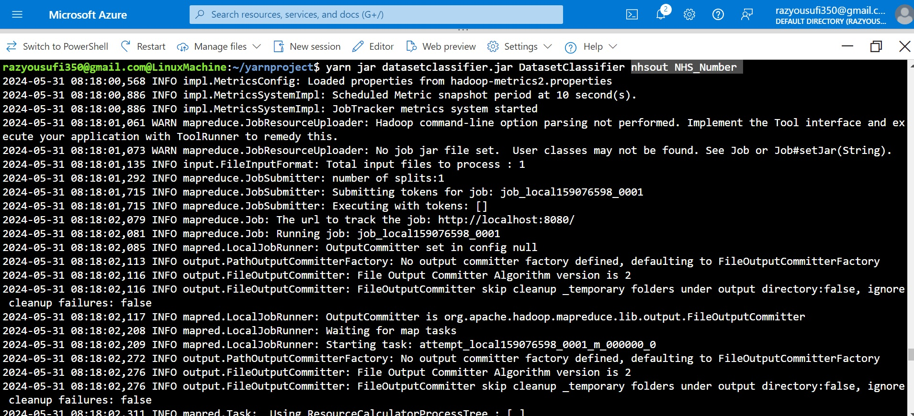
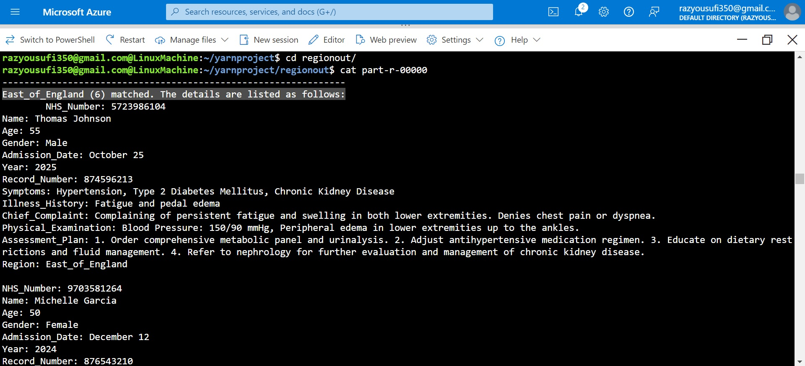

# Medical Records Processing with YARN and Hadoop MapReduce

## Overview
This project processes large-scale medical records using Hadoop's **YARN (Yet Another Resource Negotiator)** and **MapReduce** framework. It extracts, filters, and categorizes patient records based on their region while handling large datasets efficiently.

## Prerequisites
Ensure you have the following installed:
- **Hadoop** (configured in YARN mode)
- **Java JDK** (for running Hadoop jobs)
- **HDFS** (Hadoop Distributed File System)

## Compilation and Execution
### 1. Compile the Java Code
```sh
hadoop com.sun.tools.javac.Main DatasetClassifier.java
jar cf DatasetClassifier.jar DatasetClassifier*.class
```

### 2. Upload Data to HDFS
Before running the job, upload your dataset to HDFS:
```sh
hdfs dfs -mkdir -p /user/hadoop/yarnproject
hdfs dfs -put MedicalFiles.csv /user/hadoop/yarnproject/
```

### 3. Run the YARN MapReduce Job
Execute the job using YARN:
```sh
yarn jar DatasetClassifier.jar DatasetClassifier [output dir] [classification target]
```

### 4. Retrieve the Results
After execution, fetch the output:
```sh
hdfs dfs -cat /user/hadoop/output/part-r-00000
```

## Usage Example
### Input Sample
```
NHS_Number: 5723986104, Name: Thomas Johnson, Age: 55, Region: East_of_England, Symptoms: Hypertension, Type 2 Diabetes Mellitus, Chronic Kidney Disease
NHS_Number: 9703581264, Name: Michelle Garcia, Age: 50, Region: East_of_England, Symptoms: Hypertension, Dyslipidemia, Depression
```

### Expected Output
```
East_of_England (6) matched. The details are listed as follows:
    NHS_Number: 5723986104
    Name: Thomas Johnson
    Age: 55
    Symptoms: Hypertension, Type 2 Diabetes Mellitus, Chronic Kidney Disease
    ...
```


## Features
- **Distributed Processing**: Uses YARN and MapReduce for efficient large-scale data processing.
- **Automated Filtering**: Extracts relevant medical records per region.
- **Scalability**: Designed to handle massive datasets stored in HDFS.

## Notes
- Ensure YARN is running before executing the job:
  ```sh
  start-yarn.sh
  ```
- Verify the Hadoop job status using:
  ```sh
  yarn application -list
  ```
